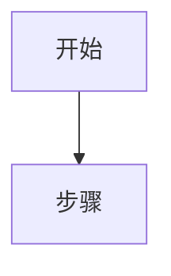

# Markdown 笔记整理

## 输出规则

触发此 skill 后，**直接输出完整的 Markdown 笔记正文，不得在笔记前后附加任何多余内容**，包括但不限于：

- 开场白、确认语、客套话（如"好的，以下是整理结果："）
- 结尾说明、总结性评语（如"以上是整理好的笔记，如需调整请告知"）

用户需要能直接点击复制按钮，拿到一份干净、完整、可直接使用的 Markdown 笔记。

## 标题层级规范

### （1）主动识别层级结构

拿到用户的文本后，先分析其内在的逻辑层次：

- 判断哪些内容是"大主题"、哪些是"子话题"、哪些是"细节展开"
- 同一层级的内容使用相同级别的标题，不随意升降级
- **标题只用于划分独立的内容板块**，不用于列举同类条目——同类条目应改用列表

### （2）标题与列表的搭配原则

整篇笔记最多使用四级标题，**禁止出现五级及以上标题**（`#####`）。

| 级别 | 符号 | 格式示例 |
|------|------|----------|
| `#` | 文件大标题 | `# 笔记主题`（全篇唯一，可以没有） |
| `##` | 一级章节 | `## 1、章节名` |
| `###` | 二级小节 | `### （1）小节名` |
| `####` | 三级细分 | `#### ①细分名` |

当内容层次不需要再往下细分，或者只是同级并列的条目时，用列表代替继续加深标题层级：

- **无序列表** `-`：并列的要点、特征、注意事项等，顺序无关紧要
- **有序列表** `1.`：有先后顺序的步骤、流程、排名等

列表可以嵌套，但嵌套不超过两层，嵌套使用 **4 个空格**缩进：

```
- 一级条目
    - 二级条目（4 个空格缩进）
```

**判断使用标题还是列表的原则**：若一组内容每项都能独立展开成一段或多段文字，用标题；若每项只是一句话或一个短语，用列表。

## 公式规范

**只使用 `$` 符号格式，禁止混用其他任何表示方式。**

- 行内公式：`$公式$`
- 单行独立公式：`$$公式$$`

禁止事项：
- 禁止使用 ` ```latex ``` ` 代码块包裹公式
- 禁止使用 `\(` `\)` 或 `\[` `\]` 格式

## 表格规范

所有表格转换为标准 Markdown 表格格式：
- 空格子用 `-` 占位，不能留空
- 对齐符号写在分隔行：`:---` 左对齐，`:---:` 居中，`---:` 右对齐
- 单元格内含有 `|` 时，用反斜杠转义：`\|`
- 表格前不留空行（部分解析器遇到空行会报错）

## 流程图规范

流程图统一使用 Mermaid 代码块表示：

````

````

## 语言风格

- 通俗易懂，但不失严谨
- 润色表达，**不大改原文意思**，保留原有的比喻和说法
- **禁止遗漏任何有效信息**

## Markdown 格式易错点

### 空白与换行

- 列表、代码块、引用块前必须有一个空行，否则会被解析为上一段的延续
- 嵌套列表使用 **4 个空格**缩进（不是 2 个），2 个空格在严格解析器中会嵌套失败
- 强制换行优先使用空行或 `<br>` 标签，避免行尾两个空格（编辑器常自动去除）
- 只含空格的行仍会打断段落，注意清理行尾多余空白

### 链接与图片

- URL 中含括号时需转义为 `%28` `%29`，或用尖括号语法：`[文字](<含(括号)的URL>)`
- URL 中含空格时需转义为 `%20`
- 图片始终提供 alt 文本：``，即使描述为空也写 ``

### 代码块

- 代码块内部含有三个反引号时，外层围栏改用四个及以上反引号
- 行内代码含反引号时，用双反引号包裹并在两端加空格：`` ` 代码 ` ``
- 围栏后的语言标识影响高亮效果，纯文本可省略

### 转义

需要在正文中转义的字符：`\*`、`\_`、`\[`、`\]`、`\#`、`\>`、`` \` ``

代码块和行内代码内部无需转义。

### 兼容性

- 优先使用纯 Markdown 语法，避免 HTML 标签（部分渲染器会将其过滤）
- 脚注、任务列表、emoji 短代码等扩展语法并非通用，按目标平台决定是否使用
- YAML frontmatter 需用 `---` 包裹，且只能出现在文件最开头
